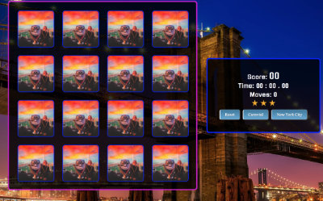

# FEND_memory_custom

## Custom Memory Card Game ##
###### Created by Victor Asselta (aka TomTheToad) ######

## Objective ##
To build a custom, dynamic memory card game from scratch, mostly.

## Description ##
This memory card game is a browser based game which displays a four by four grid of game cards, a score, timer, and basic button controls for game reset and theme selection.The user "flips" cards, two at a time, revealing a theme related back image. This game was created to satisfy a Udacity Front End Nanodegree assignment.



The game currently displays two themes which can be selected by the user. The carnival theme is based on carnival rides, games, and associated images. The New York City game displays notable buildings and statues from New York City.

## Photo Credits ##
All images, not created by myself, were originally from royalty free sites [Unsplash.com](https://unsplash.com) and [Pexels.com](https://www.pexels.com). Each image name contains as much of the original name as possible so they can be found on the aforementioned sites. Normally I would use my own imagery but, as this was a Udacity based assignment and time was a factor, I elected to use images generously offered up for free use by their creators. I would like to thank the contributors to [Unsplash.com](https://unsplash.com) and [Pexels.com](https://www.pexels.com) for this wonderful resource.

## Why I did what I did ##
This project started out as a basic logic assignment from Udacity's Front End Nanodegree program. We, the students, had the option of using given starter code or attempting a build from scratch. I decided I'd build the project from scratch. I borrowed a shuffle function from the starter code but that was all. It's been a long time since I had done anything with javascript and I thought that this would be a great opportunity, read struggle, to learn the very updated language. I found this to be a challenge, coming from type safe languages with, what seems like, better defined core elements and class definitions. The last item presented the biggest challenge. I decided that I would try and take a more object oriented approach. I'm not sure I was entirely successful but, I will say, that I learned quite a bit about the make up javascript. This project represents a "first attempt" at testing the waters in javascript.

## Running the app ##
This application is browser based and you should simply, assuming the below listed file structure is intact, be able to open the index.html file in any major, compatible browser.

## File Structure ##

```
FEND_memory_custom
  |-- css
        |-- app.css
  |--images
        |-- star.png
        |-- themes]
              |-- (associated theme images, too many to list)
  |-- js
      |-- memory-game-theme-packs.js
      |-- memory-game-theme-functions.js
      |-- memory-game-item-constructor.js
      |-- memory-game-timer.js
      |-- memory-game-clock-functions.js
      |-- memory-game-build-functions.js
      |-- memory-game-main.js
```
 
## Known Bugs ##
I have been tracking a few small issues. One issue in which an odd sequence of clicks may cause a matched card to flip back. I believe this is a race condition. The other item that comes to mind is the use of seconds returned from the clock object. This may lead to an inaccurate bonus if a move takes minutes as opposed to seconds.
  
One of the bigger issues I've been having is with the Udacity supplied shuffle function. The cards are not shuffled very well. They tend to appear in the same positions more often than not.
